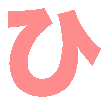
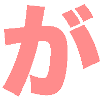
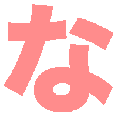
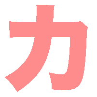
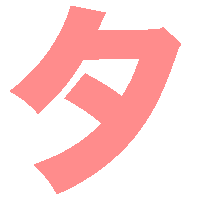
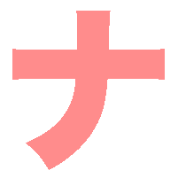
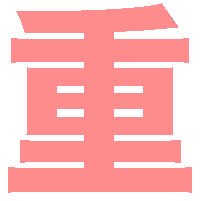
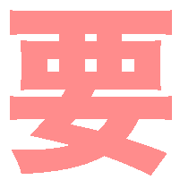

# kana-kanji-emoji
All of the Japanese Kana &amp; Joyo Kanji in the form of blinking rainbow emoji. For use on Slack or Discord.

All 2136 常用漢字 have been Emoji-fied. They are ordered by the number of their strokes.

All Hiragana + old style ゑ have been included. Includes ゛ and ゜variants of characters. Does not include combinations such as きゃ, however the small Kana are included.

All Katakana + old style ヱ have been included. Includes ゛ and ゜variants of characters. Does not include combinations such as キャ, however the small Kana are included.

Have fun being bilingual, while also bringing fun to Slack/Discord!
